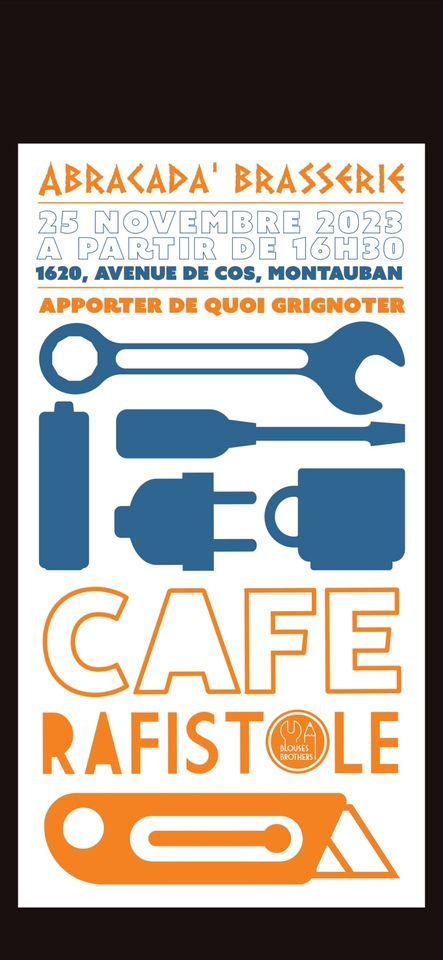

+++
title = "Agenda"
date = 2024-02-09T09:14:05+01:00
draft = false
+++

 

## notre agenda

<iframe class="mx-auto w-full h-screen p-2 md:p-4 border-4 border-mycolor-800" src="https://calendar.google.com/calendar/embed?height=600&wkst=1&bgcolor=%23ffffff&ctz=Europe%2FParis&mode=WEEK&src=bWNiZXRoODJAZ21haWwuY29t&color=%237986CB"   frameborder="0" scrolling="no"></iframe>



<!--  -->



<!--  -->





